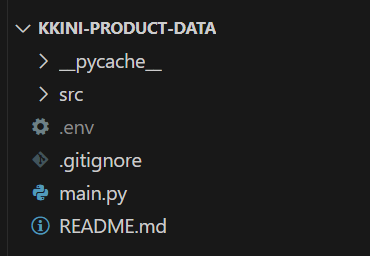

# **KKINI Project: 상품 데이터 관리 및 크롤링 시스템**

## 개요
**KKINI Project**의 일부로, 대규모 식품 데이터를 효율적으로 관리하고 실시간으로 웹 크롤링을 통해 상품 정보를 수집하는 시스템입니다. 이 프로젝트의 목표는 다음과 같은 주요 기능을 구현하는 것입니다:
- **대량의 식품 데이터 파싱**: 다양한 소스에서 수집된 식품 데이터의 체계적인 분석 및 처리.
- **영양 점수 계산**: 식품의 영양 정보를 바탕으로 한 점수 산출.
- **상품 필터링 정보의 데이터베이스 저장**: 사용자의 요구에 맞는 식품을 필터링하여 데이터베이스에 저장.
- **웹 크롤링을 통한 상품 이미지와 가격 정보의 수집 및 업데이트**: 실시간 시장 동향 반영을 위한 지속적인 데이터 갱신.

## 주요 기능
- **식품 데이터 파싱 및 DB 삽입**: `product` 테이블을 위해 5만 건의 식품 데이터를 파싱하고, 이를 데이터베이스에 Bulk Insert로 구현.
- **상품 필터링 로직 개발**: `product_filter` 테이블을 사용하여 상품의 영양정보를 기반으로 한 필터링 로직을 개발.
- **상품 이미지 및 정보 크롤링**: 네이버 쇼핑 및 기타 웹사이트에서 상품 이미지 및 정보를 크롤링하여 AWS S3에 저장.
- **Batch 프로세싱**: 대량의 데이터 처리를 위한 Batch 프로세싱을 구현하고, 서버 재가동 시 마지막 처리 지점부터 처리를 재개할 수 있도록 설계.


## 기능설명

1. **product 테이블** [src/product/parse_data.py]     
json 파일에 담겨있는 5만건의 식품 데이터를 parsing 하는 동시에 is_green, nut_score 계산하여 DB에 Bulk insert.   
> 식품데이터가 담긴 json 파일위치는 src/database/data/nutridata.json 에 있다. testdata.json 은 테스트 할 때 쓴 파일.
2. **product_filter테이블** [src/productfilter/save_nutri_filter.py]     
해당 상품이 저칼로리, 저지방, 고단백인지 등에 대한 계산을 하여 DB에 boolean 값으로 저장한다.
3. **product 테이블** [src/product/save_product_image.py]     
- 네이버 쇼핑에서 이미지 얻어와서 S3에 저장 후, public url을 product 테이블에 저장
- product_info 에 있는 이미지를 S3에 저장 후, public url을 product 테이블에 저장
4. **product_info 테이블** [src/webscraping/webscraper.py]     
3개의 사이트에서 상품의 가격, 이미지 등을 크롤링해서 가지고 온다. 이미 데이터가 존재하는 경우 값을 업데이트 한다. 
> productinfo.py 파일의 ProductInfo dataclass는 DTO 처럼 데이터를 저장/전송하는데 사용한다. 
5. **DB 쿼리문** [src/data/query.py]    
6. **크롤링 서버** [src/logs/last_batch.txt]
Batch size를 정해 특정 갯수의 상품정보를 각가의 웹사이트에서 검색하여 DB에 Bulk insert를 하는데, 상품의 갯수가 많기 때문에 마지막 batch size를 저장했다가 중단된 서버를 다시 돌릴 때 마지막 batch size부터 할 수 있게끔 했다. 


## Setup



**.env 파일**
환경변수 설정을 위한 .env 파일을 생성해서 값을 넣어줘야 한다. 
```
HOST=
USER=
PASSWORD=
DATABASE=t

#Naver Cloud
SERVICE_NAME=s3
ACCESS_KEY=
SECRET_KEY=
REGION_NAME=kr-standard
ENDPOINT_URL=https://kr.object.ncloudstorage.com

BUCKET_NAME=kkini-image-bucket
FOLDER_NAME=product-image


DATA_PATH=src/database/data/nutridata.json

USER_AGENT=Mozilla/5.0 (Windows NT 10.0; Win64; x64; rv:109.0) Gecko/20100101 Firefox/118.0

```

#PyMySQL이 MySQL 8.0 이후의 새로운 인증 방법인 caching_sha2_password를 사용.
```
pip install cryptography
```

**selenium library**
```
pip install selenium
```

**Python과 MySQL 연동을 위한 라이브러리**
```
pip install pymysql
```

## When using API to fetch data
공공데이터 api로 부터 받아온 값을 DB에 저장한다. 
HTTP 요청을 통해 API로부터 데이터를 받아오는데 python 에서는 requests library를 사용해서 API요청을 처리한다.(크롤링으로 가지고 온 이미지 url을 다운받기 위해서도 requests 라이브러리를 사용한다.)
```
pip install requests mysql-connector-python
```

## Object storage 
이미지를 S3에 저장하는 작업을 하기에 앞서 AWS SDK for Python 인 boto3 라이브러리를 설치한다
```
python -m pip install boto3
```


## user-agent 찾는 법
1. Firefox를 열고, F12 키를 눌러 개발자 도구를 실행합니다.<br>
2. "네트워크" 탭을 선택합니다.<br>
3. 어떠한 웹 페이지 (예: https://www.google.com)에 접속합니다.<br>
4. 개발자 도구의 네트워크 탭에서, 첫 번째 요청 (보통 웹 페이지의 URL과 일치)을 클릭합니다.<br>
5. 오른쪽의 상세 패널에서 "헤더" 탭을 선택합니다.<br>
6. "요청 헤더" 섹션을 찾아보면 User-Agent라는 항목 아래에 현재 사용 중인 User-Agent 문자열을 볼 수 있습니다.


## redis
NoSQL(비관계형 데이터베이스)의 한 종류로서 key-value 기반의 인메모리 저장소. RDBMS의 요청부하를 줄이기 위해 인메모리 캐시용도로 사용하기 위해 redis 적용하기로 한다. 
python에서 redis를 사용하기 위해 라이브러리를 설치한다.
```
pip install redis 
```
서버에 redis를 설치해서 데이터 조작이 가능하다.  


## is not accessedPylance 에러
Import "boto3" could not be resolved Pylance reportMissingImports

콘솔창에 pip 새 버전이 나왔다고 자꾸 떴다. Ctrl+Shift+P 키를 눌러 "Python: Select Interpreter"를 검색했더니 맞는 버전의 python interpreter 를 선택할 수 있었다. 


## 시작하기
main.py 파일 실행하면 된다. 
